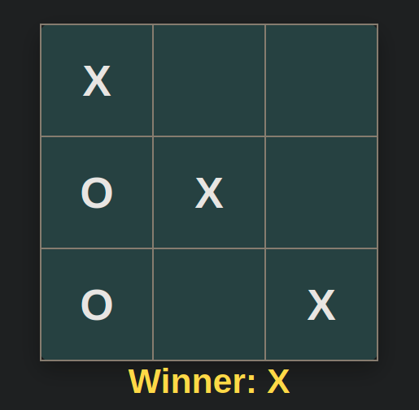

# Tic-Tac-Toe (JavaScript OOP)
Prosta gra w kółko i krzyżyk napisana w czystym JavaScript z wykorzystaniem programowania obiektowego (OOP).
---

## 🧱 Struktura projektu
Projekt oparty jest o kilka klas:

### `Turn`
Zarządza kolejnością ruchów graczy. Uproszczona implementacja wzorca Singleton, poprzez statyczne pole i metodę w klasie.

### `Cell`
Reprezentuje pojedyncze pole na planszy.

### `Row`
Zawiera 3 komórki (`Cell`).

### `Board`
Reprezentuje całą planszę (3x3).

### `Game`
Logika gry:
* sprawdzanie zwycięstwa
* stan gry (`gameOver`)

### `Renderer`
Odpowiada za:
* renderowanie planszy
* obsługę kliknięć
* aktualizację widoku

------

### `ZDJĘCIE`
